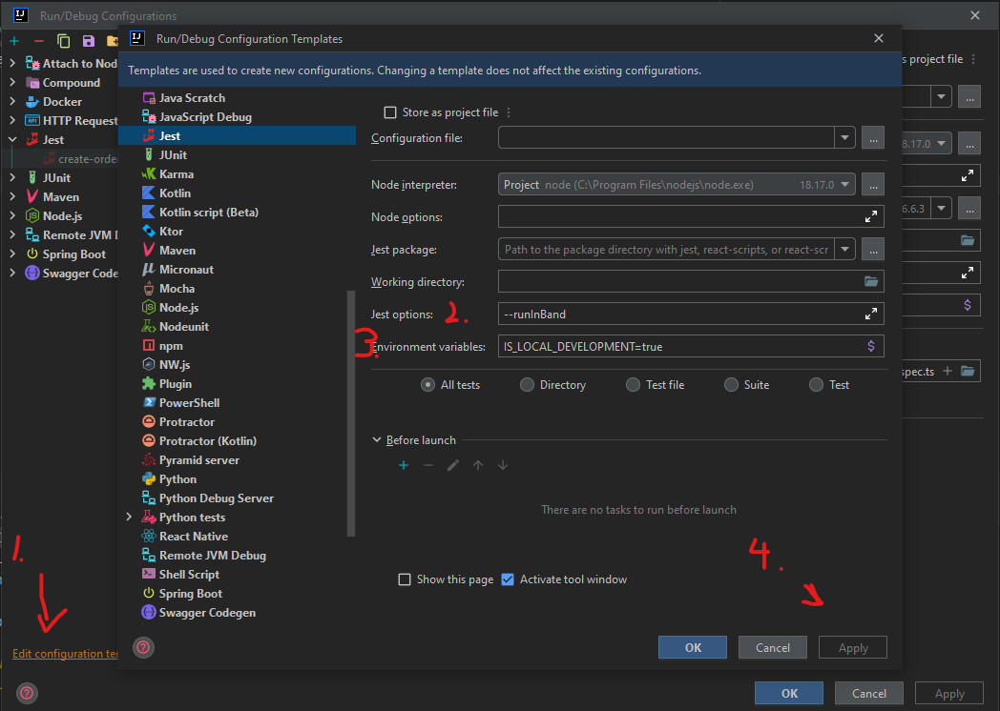

# e2e Backend Package

Package offers methods to test e2e

## Required Environment configuration
| Config  | Default value | Example | Description |
|---|---|---|---|

default jest settings for run configurations
